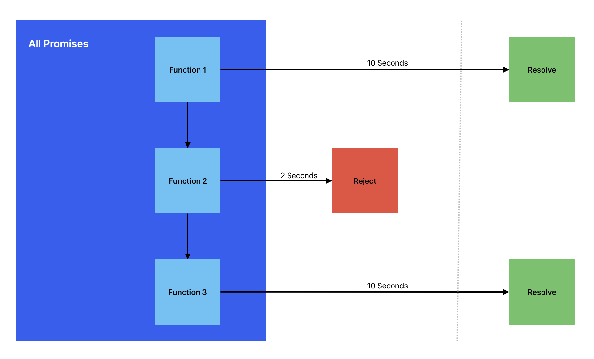

# javascript-promise

This tiny repository explains how JavaScript Promises have been implemented.

### 🧱 System Architecture

From `index.js` file, I used `.all()` to wrap 3 memory-expensive promised functions.

In order to simulate promise concurrency, I put timeout functions to differentiate all 3 functions.

The expensiveCalculation1 will execute for 2 seconds.

The expensiveCalculation2 will execute for 2 seconds and will get rejected.

The expensiveCalculation3 will execute for 10 seconds but will be ignored.

Nothing will be resolved at all.

The asynchronous event will stop once one promise function within the concurrency rejects.

This method helps the computer lessen time space in executing expensive calculations.
