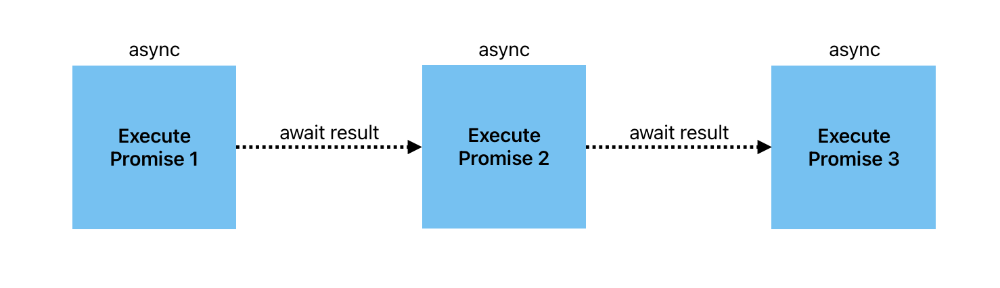
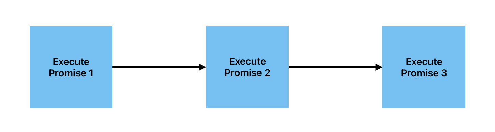
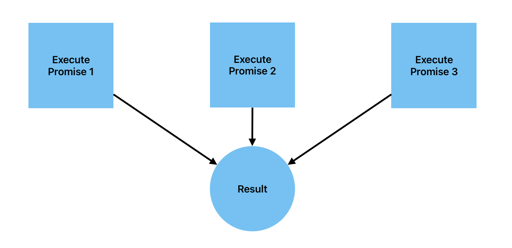

# javascript-promise

This tiny repository explains 3 different JavaScript Promises, **All**, **Any**, and **Race**.

## Promise.all()

### 🧱 System Architecture


`Promise.all()` runs 3 memory-expensive functions concurrently.

To demonstrate, I put timeout function for each functions and set different execution time.

The expensiveCalculation1 will execute for 2 seconds.

The expensiveCalculation2 will also execute for 2 seconds but will get rejected.

The expensiveCalculation3 will execute for 10 seconds but will be ignored because expensiveCalculation2 was rejected.

The asynchronous `Promise.all()` will stop once one promise function within the concurrency rejects.

This method helps the computer lessen time space in executing expensive calculations.

### Sequential Diagram

When executing multiple & time space expensive functions, like in the `index.js`, we should not use sequential method in order to prevent bottleneck in the flow of your system.

Example of sequential method:

```
const user = await getUser();
const profile = await getProfile(user);
const skills = await getSkills(profile);
```

### Concurrent Diagram

To avoid sequential flow of the system, we are wrapping all functions to asynchronous `Promise.all()` that awaits if failure / error happens.

### Parallel Diagram

JavaScript in this example uses NodeJS to execute `index.js`. That means, we must assume that there is no parallel execution happened because the runtime is single threaded, it will not execute multiple tasks at once.

### **Promise.all() vs. Promise.allSettled()**

- **Promise.all()**: This function takes an array of promises as input and returns a single promise. This promise resolves when all the promises in the array have resolved, or rejects as soon as one of the promises rejects.

- **Promise.allSettled()**: This function also takes an array of promises as input and returns a single promise. However, unlike Promise.all(), it waits for all promises to settle (either resolve or reject) before it resolves. It doesn't short-circuit if one of the promises rejects. Instead, it waits for all promises to finish, providing the result of each promise in an array, regardless of whether they resolved or rejected.

### **Promise.race() vs. Promise.any()**:

- **Promise.race()**: This function takes an array of promises as input and returns a single promise. It resolves or rejects as soon as one of the promises in the array resolves or rejects. The result of the first settled promise (either resolved or rejected) is passed through.

- **Promise.any()**: This function also takes an array of promises as input and returns a single promise. It resolves as soon as one of the promises in the array resolves. If all promises are rejected, then it rejects with an array of reasons for all the rejected promises.

In simpler terms, Promise.all() and Promise.race() are focused on multiple promises, while Promise.allSettled() and Promise.any() are more about handling multiple promises but with different criteria for resolving or rejecting.