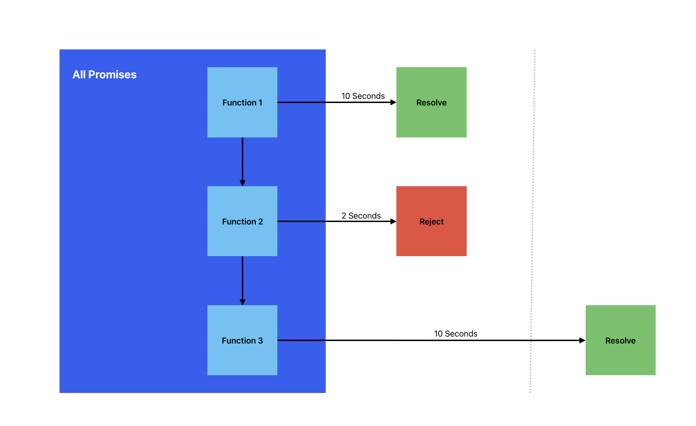

# javascript-promise

This tiny repository explains how JavaScript Promises have been implemented.

### 🧱 System Architecture


From `index.js`, I used `Promise.all()` to run 3 memory-expensive promised functions concurrently.

To demonstrate, I put timeout function for each functions and set different execution time.

The expensiveCalculation1 will execute for 2 seconds.

The expensiveCalculation2 will also execute for 2 seconds but will get rejected.

The expensiveCalculation3 will execute for 10 seconds but will be ignored because expensiveCalculation2 was rejected.

The asynchronous `Promise.all()` will stop once one promise function within the concurrency rejects.

This method helps the computer lessen time space in executing expensive calculations.

### Sequential Diagram

When executing multiple & time space expensive functions, like in the `index.js`, we should not use sequential method in order to prevent bottleneck in the flow of your system.

Example of sequential method:

```
const user = await getUser();
const profile = await getProfile(user);
const skills = await getSkills(profile);
```

### Concurrent Diagram

To avoid sequential flow of the system, we are wrapping all functions to asynchronous `Promise.all()` that awaits if failure / error happens.

### Parallel Diagram

JavaScript in this example uses NodeJS to execute `index.js`. That means, we must assume that there is no parallel execution happened because the runtime is single threaded, it will not execute multiple tasks at once.
